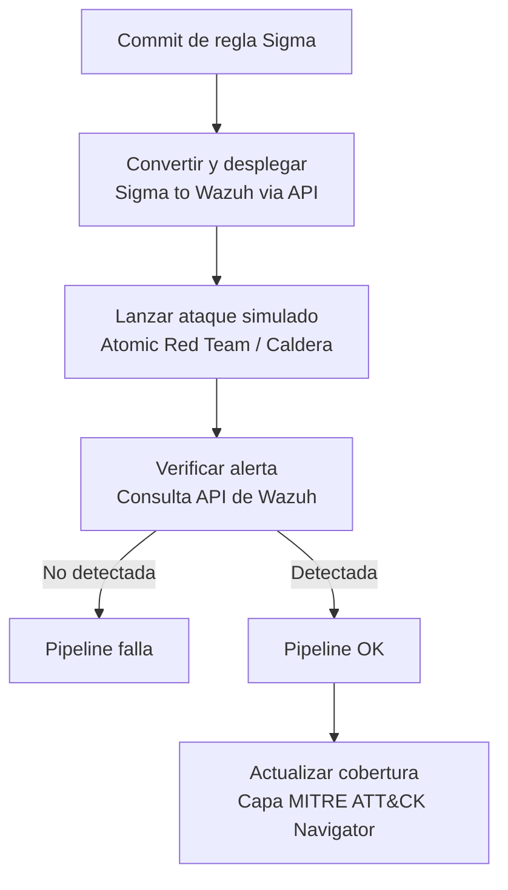

# Arquitectura

Este documento describe cómo encajan los componentes de Detection-as-Code, el flujo detallado de ejecución del pipeline, y las decisiones de diseño detrás de cada elección técnica.

## Diagrama de flujo

Cada etapa se ejecuta como un job independiente en el pipeline de GitLab CI, de forma que un fallo en cualquier etapa detiene el flujo antes de tocar producción.

## Componentes

### 1. Repositorio de reglas Sigma (`rules/sigma/`)

Fuente de verdad del proyecto. Cada regla es un archivo YAML en formato Sigma, organizado por táctica MITRE ATT&CK. No se editan reglas directamente en Wazuh: cualquier cambio pasa primero por aquí y por el pipeline.

### 2. Mapeo de tests (`tests/atomics-mapping.yml`)

Archivo que asocia cada regla Sigma con el test atómico (o secuencia de Caldera) que debería activarla, y con la técnica MITRE ATT&CK correspondiente. Este mapeo es lo que permite automatizar "esta regla se valida así" sin lógica hardcodeada en el pipeline.

### 3. Scripts de automatización (`scripts/`)

- **`deploy_rule.py`** — convierte la regla Sigma a formato Wazuh (usando `sigma-cli`/`pySigma` con el backend de Wazuh) y la despliega vía la API de gestión de Wazuh.
- **`run_atomic.py`** — lanza el test correspondiente contra el laboratorio AD, usando Atomic Red Team (`Invoke-AtomicTest`) o disparando una operación de Caldera vía su API REST.
- **`verify_alert.py`** — consulta la API de Wazuh (endpoint de alertas) en una ventana de tiempo posterior a la ejecución del ataque, buscando una alerta que coincida con la regla desplegada.

### 4. Pipeline CI/CD (`pipeline/.gitlab-ci.yml`)

Orquesta las etapas anteriores como jobs secuenciales de GitLab CI, ejecutándose en un runner con acceso de red al laboratorio AD y a la API de Wazuh.

### 5. Generador de cobertura (`coverage/`)

Job que, tras una validación exitosa, actualiza `navigator-layer.json` — un archivo en el formato de capa de MITRE ATT&CK Navigator que refleja el estado de cobertura acumulado del proyecto.

## Flujo detallado, paso a paso

1. **Trigger**: un commit o merge request que modifica algo en `rules/sigma/` dispara el pipeline.
2. **Validación estática**: se comprueba que la regla Sigma es sintácticamente válida y que tiene una entrada correspondiente en `atomics-mapping.yml`. Si falta el mapeo, el pipeline falla aquí — no tiene sentido continuar sin saber cómo probar la regla.
3. **Conversión y despliegue**: `deploy_rule.py` convierte la regla a formato Wazuh y la despliega en una instancia de Wazuh (idealmente un entorno de staging, no producción directamente — ver "Decisiones de diseño").
4. **Emulación del ataque**: `run_atomic.py` ejecuta el test atómico o la operación de Caldera mapeada, contra el laboratorio AD.
5. **Ventana de espera**: se espera un margen de tiempo (configurable, típicamente 30-60s) para dar margen a que Wazuh procese los logs y genere la alerta.
6. **Verificación**: `verify_alert.py` consulta la API de Wazuh buscando una alerta que coincida con el ID de la regla desplegada, dentro de la ventana temporal del ataque.
7. **Decisión**:
   - Si no se encuentra la alerta → el job falla, el merge request queda bloqueado, la regla no llega a producción.
   - Si se encuentra → el pipeline continúa.
8. **Actualización de cobertura**: se actualiza `navigator-layer.json` marcando la técnica MITRE correspondiente como cubierta, con la fecha de validación y opcionalmente un nivel de confianza (por ejemplo, basado en cuántas veces ha pasado la validación de forma consistente).
9. **Despliegue final**: si el entorno de staging y producción son distintos, un job adicional (manual o automático) promociona la regla ya validada a la instancia de Wazuh de producción.

## Decisiones de diseño

**¿Por qué Sigma y no reglas nativas de Wazuh directamente?**
Sigma es agnóstico del SIEM. Escribir en Sigma significa que la lógica de detección no queda atada a Wazuh — si en el futuro se quisiera migrar a otro SIEM, o contribuir la regla a la comunidad, el formato ya es el estándar que se usa fuera de este proyecto.

**¿Por qué separar staging de producción (si se implementa así)?**
Ejecutar ataques reales contra un entorno de producción real (si lo hubiera) sería arriesgado. Aunque este proyecto es un laboratorio, replicar esta separación demuestra una práctica real de la industria: nunca se valida contra el sistema que se está protegiendo activamente sin control adicional.

**¿Por qué falla el pipeline en lugar de solo generar una alerta o advertencia?**
El principio central de "detección como código" es que una regla sin validación pasada no es una regla de confianza. Permitir que una regla no validada llegue a producción socavaría todo el propósito del proyecto — igual que un pipeline de software no debería desplegar código con tests rotos.

**¿Por qué un mapeo explícito regla-test en vez de inferencia automática?**
Podría intentarse inferir automáticamente qué test dispara qué regla a partir de metadatos de la regla Sigma (el campo `tags` con la técnica ATT&CK, por ejemplo). Se ha optado por un mapeo explícito para evitar ambigüedad: puede haber varias formas de probar la misma técnica, y el mapeo documenta explícitamente cuál se ha elegido y por qué.

**¿Por qué generar la capa de Navigator como artefacto versionado y no como un dashboard en vivo?**
Un archivo JSON versionado en Git es reproducible, revisable en el historial de commits, y no depende de mantener un servicio adicional corriendo. Se puede cargar en cualquier momento en la instancia pública de MITRE ATT&CK Navigator sin infraestructura propia — coherente con el requisito de que todo sea gratuito y sin dependencias de pago.

## Consideraciones de seguridad del propio pipeline

- El runner de GitLab CI necesita credenciales con permisos suficientes para desplegar reglas en Wazuh y ejecutar ataques en el AD lab. Estas credenciales deben tratarse como secretos de CI (GitLab CI/CD variables protegidas), nunca en texto plano en el repositorio.
- El laboratorio AD donde se ejecutan los ataques debe estar completamente aislado de cualquier red que no sea el propio entorno de pruebas.
- Los tests atómicos y operaciones de Caldera ejecutados deben limitarse a los mapeados explícitamente — el pipeline no debe tener la capacidad de ejecutar comandos arbitrarios más allá de lo definido en `atomics-mapping.yml`.

## Extensibilidad futura

- **Múltiples plataformas**: el diseño actual asume Windows/AD como objetivo principal; el mismo patrón (regla → test → verificación → cobertura) es extensible a Linux o cloud si se añaden los tests atómicos correspondientes.
- **Caldera para cadenas completas**: una vez el pipeline funcione con tests atómicos aislados (Fase 3-4), se puede extender para ejecutar operaciones de Caldera que encadenen varias técnicas, permitiendo validar detecciones de comportamiento y no solo de eventos puntuales.
- **Confianza ponderada por historial**: el campo de "confianza" en la capa de cobertura podría evolucionar de un valor fijo a un cálculo basado en el histórico de validaciones (por ejemplo, cuántas ejecuciones consecutivas ha pasado la regla).
